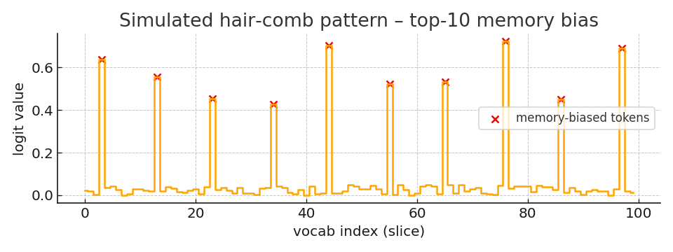

## Memory-Bias “Hair-Comb” Pattern

The sampler adds a sparse bias vector to the raw logits.  
When plotted, the top-10 memory tokens pop out as evenly spaced “teeth”:

The plot shows a simulated 100-token slice; your live run should display a similar comb if the memory fusion is working.
